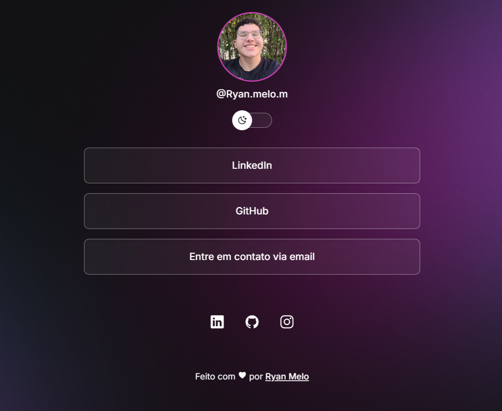

<h1 align="center"> Social Links </h1>
<h3 align="center"> Página única com múltiplos links para organizar e compartilhar conteúdos </h3>

  <a href="#techs">Tecnologias</a>
  &nbsp;&nbsp;&nbsp;|&nbsp;&nbsp;&nbsp;
  <a href="#techs">Features</a>

 

  

  (Clique na imagem para acessar o site)

 

  
## 🚀 Tecnologias

Esse projeto foi desenvolvido com as seguintes tecnologias:

- HTML e CSS
- JavaScript
- Git e Github
- Figma

## 💻 Features 

Esse projeto tem as seguintes features:

- Página Personalizável
- Página Personalizável
- Integração com Redes Sociais
- Dark Mode
- Responsividade

  

    Feito com ♥ by <a href="https://github.com/ryan-melo" target="_blank">Ryan Melo</a> &nbsp;&nbsp;&nbsp;|&nbsp;&nbsp;&nbsp; 
    :wave: Me acompanhe no <a href="https://www.linkedin.com/in/ryan-melo-m/" target="_blank">LinkedIn</a>!
  

